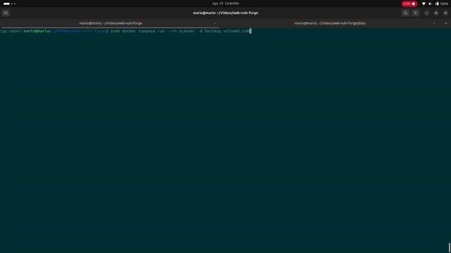

# ⬡ VULN-FORGE


> **Automated Web Vulnerability Scanner — Red Team Pipeline**
>
> A full recon-to-exploit pipeline that takes a domain and runs it through subdomain
> enumeration, live host detection, endpoint crawling, parameter discovery, and
> multi-tool vulnerability scanning — all from a single command or a sleek web dashboard.

---

## Table of Contents

- [Demo](#demo)
- [Legal Disclaimer](#️-legal-disclaimer)
- [Pipeline Architecture](#pipeline-architecture)
- [Features](#features)
- [Tool Stack](#tool-stack)
- [vs Manual Approach](#vs-manual-approach)
- [Project Structure](#project-structure)
- [Prerequisites](#prerequisites)
- [Quick Start](#quick-start)
- [Docker Compose Services](#docker-compose-services)
- [CLI Flags Reference](#cli-flags-reference)
- [Web Dashboard](#web-dashboard)
- [Sample Output](#sample-output)
- [Database Schema](#database-schema)
- [Pipeline Constants](#pipeline-constants)
- [Environment Variables](#environment-variables)
- [Volume & Data Management](#volume--data-management)
- [Rebuilding After Changes](#rebuilding-after-changes)
- [Troubleshooting](#troubleshooting)
- [Known Limitations](#known-limitations)
- [Changelog](#changelog)

## ⚠️ Legal Disclaimer

**This tool is for authorized security testing only.**
Only run Vuln-Forge against targets you own or have explicit written permission to test.
Unauthorized use is illegal and unethical. The author assumes no liability for misuse.

---

## Pipeline Architecture

```
                        ┌─────────────────────────────────────────────────────────┐
                        │                      VULN-FORGE                         │
                        └─────────────────────────────────────────────────────────┘
                                                    │
                                               [ Domain ]
                                                    │
                    ┌───────────────────────────────▼────────────────────────────┐
                    │                    STAGE 1 — SUBDOMAINS                    │
                    │               crt.sh  │  Amass  │  Subfinder               │
                    └───────────────────────────────┬────────────────────────────┘
                                                    │
                    ┌───────────────────────────────▼────────────────────────────┐
                    │                   STAGE 2 — LIVE HOSTS                     │
                    │                           httpx                             │
                    └───────────────────────────────┬────────────────────────────┘
                                                    │
                    ┌───────────────────────────────▼────────────────────────────┐
                    │                   STAGE 3 — ENDPOINTS                      │
                    │                     Katana  │  gau                         │
                    └───────────────────────────────┬────────────────────────────┘
                                                    │
                    ┌───────────────────────────────▼────────────────────────────┐
                    │                  STAGE 4 — PARAMETERS                      │
                    │                           Arjun                             │
                    └───────────────────────────────┬────────────────────────────┘
                                                    │
                    ┌───────────────────────────────▼────────────────────────────┐
                    │               STAGE 5 — VULNERABILITY SCAN                 │
                    │     Nuclei  │  Nikto  │  SQLMap (conditional)  │  Dalfox   │
                    └───────────────────────────────┬────────────────────────────┘
                                                    │
                              ┌─────────────────────┴─────────────────────┐
                              │                                             │
                    ┌─────────▼──────────┐                    ┌────────────▼────────────┐
                    │   Discord Alert    │                    │   Telegram Alert        │
                    └────────────────────┘                    └─────────────────────────┘
```

---

## Features

- **Full pipeline** — Subdomains → Live Hosts → Endpoints → Parameters → Vulnerabilities
- **Multi-tool scanning** — Nuclei, Nikto, SQLMap (conditional), Dalfox, more tools in future releases
- **Smart SQL detection** — Only runs SQLMap when SQL technology is actually detected
- **Web dashboard** — Real-time terminal feed, pipeline status, results table, PDF/CSV export
- **Notifications** — Discord and Telegram alerts on findings, sorted by severity
- **Docker-first** — Everything runs in containers, zero local tool installs needed
- **Test mode** — Cap all inputs to 1 for rapid validation runs
- **Compose services** — Every pipeline stage runnable independently via `docker compose`
- **Abort support** — Kill a running scan from the web UI at any time
- **Auto-reconnect** — Web dashboard reconnects to active scan on page refresh

---

## Tool Stack

| Stage | Tools |
|---|---|
| Subdomain Enumeration | crt.sh, Amass, Subfinder |
| Live Host Detection | httpx |
| Endpoint Discovery | Katana, gau |
| Parameter Discovery | Arjun |
| Vulnerability Scanning | Nuclei, Nikto, SQLMap, Dalfox |
| Notifications | Discord Webhooks, Telegram Bot API |
| Web UI | FastAPI, WebSocket, WeasyPrint |

---

## vs Manual Approach

| Task | Manual | Vuln-Forge |
|---|---|---|
| Subdomain enumeration | 3 separate tool commands | ✅ Automatic |
| Deduplication of results | Manual grep/sort | ✅ Automatic via SQLite UNIQUE |
| Live host filtering | Manual httpx run | ✅ Automatic |
| Endpoint crawling | Manual Katana + gau | ✅ Automatic |
| Parameter discovery | Manual Arjun per URL | ✅ Automatic |
| SQL tech detection | Guess and check | ✅ Smart auto-detection |
| Running all vuln tools | 4 separate commands | ✅ One pipeline |
| Storing results | Manual files/notes | ✅ Structured SQLite DB |
| Notifications | Manual copy-paste | ✅ Auto Discord + Telegram |
| Viewing results | Terminal grep | ✅ Web dashboard + PDF |
| Re-running a single stage | Re-type full command | ✅ `docker compose run --rm <stage>` |

---

## Project Structure

```
vuln-forge/
├── main.py                     ← Full pipeline entrypoint
├── database.py                 ← SQLite helpers + schema
├── requirements.txt            ← Python dependencies
├── pyproject.toml              ← Python project config
├── Dockerfile                  ← Scanner image (golang:1.25 multi-stage)
├── docker-compose.yml          ← All services
├── .env                        ← Secrets (gitignored)
├── .env.example                ← Example env file
├── .gitignore
│
├── pipeline/
│   ├── subdomains.py           ← Stage 1: crt.sh + Amass + Subfinder
│   ├── live_hosts.py           ← Stage 2: httpx
│   ├── endpoints.py            ← Stage 3: Katana + gau
│   ├── parameters.py           ← Stage 4: Arjun
│   └── vulnerabilities.py      ← Stage 5: Nuclei + Nikto + SQLMap + Dalfox
│
├── tools/
│   ├── amass.py
│   ├── subfinder.py
│   ├── httpx.py
│   ├── katana.py
│   ├── gau.py
│   ├── crtsh.py
│   ├── arjun.py
│   ├── sqlmap.py
│   ├── dalfox.py
│   ├── nuclei.py
│   └── nikto.py
│
├── notifier/
│   ├── discord.py
│   └── telegram.py
│
├── utils/
│   └── view_vulnerabilities.py
│
├── web/
│   ├── app.py                  ← FastAPI backend
│   ├── Dockerfile              ← Web image (FROM vuln-forge:latest)
│   ├── templates/
│   │   └── index.html
│   └── static/
│       ├── css/style.css
│       └── js/main.js
│
├── docs/
│   ├── demo-cli.gif            ← CLI demo GIF
│   └── demo-web.gif            ← Web dashboard demo GIF
│
└── data/                       ← Scan databases (gitignored)
    └── example.com.db
```

---

## Demo

### CLI Pipeline

<p align="center">
  
</p>

> Full scan running in terminal — pipeline stages, live findings, Discord notification firing.

### Web Dashboard

<p align="center">
  
</p>

> Typing a domain → Launch → live terminal feed → results populating → finding detail modal → PDF download.

---

---

## Prerequisites

- Docker Engine 25.0+
- Docker Compose V2 plugin

### Check if Docker Compose installed

```bash
docker compose version
```

If it prints `Docker Compose version v2.x.x` you are ready. If not, install it:

### Install Docker Compose V2 Plugin

```bash
https://github.com/docker/compose
```

---

## Quick Start

### 1. Clone the repository

```bash
git clone https://github.com/vulnace/vuln-forge.git
cd vuln-forge
```

### 2. Configure environment variables

```bash
cp .env.example .env
```

Edit `.env`:

```env
DISCORD_WEBHOOK=https://discord.com/api/webhooks/YOUR_WEBHOOK_ID/YOUR_WEBHOOK_TOKEN
TELEGRAM_BOT_TOKEN=XXXXXXXXXX:XXXXXXXXXXXXXX
TELEGRAM_CHAT_ID=XXXXXXXXXXXXX
```

> Notifications are optional. Leave values empty or use `--no-notify` to skip them.

### 3. Build Docker images

> ⚠️ **Build order matters** — scanner image must be built before web image.

```bash
# Step 1 — Build scanner image (golang:1.25 multi-stage, ~930MB, takes ~10 mins)
sudo docker compose build scanner

# Step 2 — Build web image (FROM vuln-forge:latest, ~960MB)
sudo docker compose build web
```

### 4. Start the web dashboard

```bash
sudo docker compose up -d web
```

Open `http://localhost:8000` in your browser.

### 5. Run your first scan

```bash
sudo docker compose run --rm scanner -d example.com
```

Watch results appear live in the web dashboard at `http://localhost:8000`.

---

## Docker Compose Services

All services share a named Docker volume `vf-scan-data` and an isolated bridge
network `vf-network`. Data persists across container restarts and removals.

### Web Dashboard

```bash
# Start in background (recommended)
sudo docker compose up -d web

# Start in foreground to see logs
sudo docker compose up web

# Follow logs while running in background
sudo docker compose logs -f web

# Stop dashboard
sudo docker compose down
```

Access at `http://localhost:8000`

---

### Full Pipeline Variants

| Service | Command | Description |
|---|---|---|
| `scanner` | `sudo docker compose run --rm scanner -d example.com` | Standard full scan |
| `scanner-fresh` | `sudo docker compose run --rm scanner-fresh -d example.com` | Wipe DB then full scan |
| `scanner-active` | `sudo docker compose run --rm scanner-active -d example.com` | Enable Amass active DNS |
| `scanner-test` | `sudo docker compose run --rm scanner-test -d example.com` | Cap all inputs to 1 |
| `scanner-silent` | `sudo docker compose run --rm scanner-silent -d example.com` | Skip notifications |
| `scanner-full` | `sudo docker compose run --rm scanner-full -d example.com` | Fresh + Active + Silent |

---

### Standalone Pipeline Stages

Run individual stages against an existing database for debugging or re-running:

```bash
# Subdomain enumeration only
sudo docker compose run --rm subdomains -- -d example.com -db data/example.com.db

# Live host detection only
sudo docker compose run --rm livehosts -- -db data/example.com.db

# Endpoint discovery only
sudo docker compose run --rm endpoints -- -db data/example.com.db

# Parameter discovery only
sudo docker compose run --rm parameters -- -db data/example.com.db

# Vulnerability scan only
sudo docker compose run --rm vuln -- -db data/example.com.db

# Vulnerability scan — test mode (cap to 1)
sudo docker compose run --rm vuln-test -- -db data/example.com.db

# Nikto against a specific URL
sudo docker compose run --rm nikto -- -u https://example.com
```

---

### Utilities

```bash
# View results as a CLI table
sudo docker compose run --rm view -- -db data/example.com.db

# Resend Discord notification for a scan
sudo docker compose run --rm notify-discord -- -db data/example.com.db

# Resend Telegram notification for a scan
sudo docker compose run --rm notify-telegram -- -db data/example.com.db
```

---

## CLI Flags Reference

```
python3 main.py -d <domain> [options]

Required:
  -d, --domain      Target domain

Optional:
  --fresh           Wipe existing scan data before starting
  --yes             Auto-confirm fresh wipe (skip prompt)
  --active          Enable Amass active DNS enumeration (noisier, more thorough)
  --test            Cap all tool inputs to 1 (fast validation)
  --no-notify       Skip Discord and Telegram notifications
  --debug           Verbose debug logging
```

### Combining flags

```bash
# Fresh + active + silent
sudo docker compose run --rm scanner -d example.com --fresh --yes --active --no-notify

# Test mode + debug (see what's happening without noise)
sudo docker compose run --rm scanner -d example.com --test --debug

# Full aggressive scan
sudo docker compose run --rm scanner -d example.com --fresh --yes --active

# Vulnerability stage only, debug, no notifications
sudo docker compose run --rm vuln -- -db data/example.com.db --debug --no-notify
```

---

## Web Dashboard

### Features

| Feature | Description |
|---|---|
| **Live Terminal** | Real-time WebSocket log feed from running scan |
| **Pipeline Status** | Visual stage tracker — Subdomains → Hosts → Endpoints → Params → Vulns |
| **Results Table** | Filter by severity, full-text search, click row for detail modal |
| **Stat Cards** | Critical / High / Medium / Low / Info counts with animated count-up |
| **PDF Report** | Download full scan report generated by WeasyPrint |
| **CSV Export** | Client-side CSV download of all findings |
| **Re-notify** | Resend Discord/Telegram alerts for any completed scan |
| **History** | All previous scans with VIEW / PDF / CSV buttons per card |
| **Auto-reconnect** | Reconnects to active scan automatically on page refresh |
| **Abort** | Kill a running scan from the UI instantly |

### Dashboard Scan Toggles

| Toggle | CLI Equivalent | Description |
|---|---|---|
| FRESH DATABASE | `--fresh --yes` | Wipe existing scan data |
| TEST MODE | `--test` | Cap all inputs to 1 |
| ACTIVE RECON | `--active` | Enable Amass active DNS |
| SILENT MODE | `--no-notify` | Skip notifications |
| DEBUG OUTPUT | `--debug` | Verbose logs in terminal |

---

## Sample Output

### Terminal (CLI)

```
[*] ══════════════════════════════════════
[*]  TARGET: EXAMPLE.COM
[*] ══════════════════════════════════════
[*] Initializing pipeline...
[+] Stage 1: Subdomain Enumeration
[+] crt.sh found 12 subdomains
[+] Subfinder found 8 subdomains
[+] 14 unique subdomains stored
[+] Stage 2: Live Host Detection
[+] httpx — 6 live hosts found
[+] Stage 3: Endpoint Discovery
[+] Katana crawled 342 endpoints
[+] gau found 89 historical endpoints
[+] 387 unique endpoints stored
[+] Stage 4: Parameter Discovery
[+] Arjun found 23 parameters across 8 URLs
[+] Stage 5: Vulnerability Scan
[+] Nuclei: 4 findings
[+] Nikto: 7 findings
[+] SQL technology detected — running SQLMap
[+] SQLMap: 2 SQL injection findings
[+] Dalfox: 3 XSS findings
[+] ══════════════════════════════════════
[+]  OPERATION COMPLETE — 16 FINDINGS
[+] ══════════════════════════════════════
```

### Vulnerability Findings

```
┌─────────────────────────────────────────────────────────────────────────┐
│  VULN-FORGE // RESULTS — example.com — 16 findings                      │
├────┬──────────┬─────────────────────┬──────────┬────────────────────────┤
│ #  │ SEVERITY │ TYPE                │ TOOL     │ TARGET                 │
├────┼──────────┼─────────────────────┼──────────┼────────────────────────┤
│  1 │ CRITICAL │ SQL Injection       │ sqlmap   │ example.com            │
│  2 │ CRITICAL │ SQL Injection       │ sqlmap   │ example.com/search     │
│  3 │ HIGH     │ XSS Reflected       │ dalfox   │ example.com/book       │
│  4 │ HIGH     │ XSS Stored          │ dalfox   │ stg.examle.com         │
│  5 │ HIGH     │ WordPress Vuln      │ nuclei   │ dev.example.com        │
│  6 │ MEDIUM   │ Missing Headers     │ nikto    │ example.com            │
│  7 │ LOW      │ Info Disclosure     │ nuclei   │ bookings.example.com   │
└────┴──────────┴─────────────────────┴──────────┴────────────────────────┘
```

### Discord Notification

```
🔴 CRITICAL — SQL Injection
Tool: sqlmap
Target: sub.example.com/reserve?id=1
Details: parameter=id, payload=1' OR '1'='1

🟠 HIGH — XSS Reflected
Tool: dalfox
Target: example.com/book?name=test
Details: parameter=name, payload=<script>alert("PaaPaaMaaaa..")</script>
```

---

## Database Schema

Results are stored in SQLite at `data/<domain>.db`.

```sql
-- Discovered subdomains
CREATE TABLE subdomains (
    id        INTEGER PRIMARY KEY,
    subdomain TEXT UNIQUE,
    source    TEXT
);

-- Live HTTP/HTTPS hosts
CREATE TABLE live_hosts (
    id     INTEGER PRIMARY KEY,
    url    TEXT UNIQUE,
    status INTEGER
);

-- Crawled endpoints
CREATE TABLE endpoints (
    id  INTEGER PRIMARY KEY,
    url TEXT UNIQUE
);

-- Discovered parameters
CREATE TABLE parameters (
    id        INTEGER PRIMARY KEY,
    url       TEXT,
    parameter TEXT,
    UNIQUE(url, parameter)
);

-- Vulnerability findings
CREATE TABLE vulnerabilities (
    id       INTEGER PRIMARY KEY,
    type     TEXT,
    target   TEXT,
    severity TEXT,
    tool     TEXT,
    details  TEXT,
    UNIQUE(type, target, tool)
);
```

---

## Pipeline Constants

Configurable caps in `pipeline/vulnerabilities.py`:

```python
MAX_ENDPOINTS   = 500   # Max endpoints sent to Nuclei
MAX_PARAM_URLS  = 100   # Max URLs sent to Dalfox
MAX_TOOL_INPUTS = 20    # Max inputs per tool in normal mode
MAX_NIKTO_HOSTS = 10    # Max hosts scanned by Nikto
```

`--test` mode caps all inputs to 1 regardless of these constants.

---

## Environment Variables

| Variable | Description | Required |
|---|---|---|
| `DISCORD_WEBHOOK` | Discord incoming webhook URL | No |
| `TELEGRAM_BOT_TOKEN` | Telegram bot API token | No |
| `TELEGRAM_CHAT_ID` | Telegram chat or channel ID | No |

```

---

## Volume & Data Management

Scan databases are stored in a named Docker volume `vf-scan-data`.

```bash
# Inspect volume location on host
sudo docker volume inspect vf-scan-data

# List all volumes
sudo docker volume ls

# Remove volume (deletes all scan data)
sudo docker volume rm vf-scan-data
```

### Switch to local folder instead of named volume

If you prefer scan data in `./data/` on your host, update every volume entry
in `docker-compose.yml` from:

```yaml
volumes:
  - scan-data:/app/data
```

to:

```yaml
volumes:
  - ./data:/app/data
```

And remove the `volumes:` block at the bottom of the file.

Fix permissions if needed:

```bash
sudo chown -R $USER:$USER data/
```

---

## Rebuilding After Changes

```bash
# After changing pipeline/, tools/, notifier/, or main.py
sudo docker compose build scanner

# After changing web/app.py, templates, or static files
sudo docker compose build web

# Rebuild both at once
sudo docker compose build scanner web

# Force rebuild with no cache (if something is stuck)
sudo docker compose build --no-cache scanner
sudo docker compose build --no-cache web
```

---

## Troubleshooting

### Docker daemon not running

```bash
sudo systemctl restart docker
sudo systemctl status docker
```

### Permission denied on data directory

```bash
sudo chown -R $USER:$USER data/
# or
sudo chmod 777 data/
```

### Port 8000 already in use

```bash
# Find what is using it
sudo lsof -i :8000

# Change the port in docker-compose.yml
ports:
  - "8080:8000"   # use 8080 on host instead
```

### Web image fails to build

```bash
# Make sure scanner image exists first
sudo docker images | grep vuln-forge

# If missing, build scanner first
sudo docker compose build scanner
sudo docker compose build web
```

### Scan shows "already running" after page refresh

The web UI auto-reconnects to active scans. If stuck, clear it via the ABORT button
or from the terminal:

```bash
curl -X POST http://localhost:8000/api/scan/clear/example.com
```

### SQLMap not running

SQLMap only runs when SQL technology is detected. Vuln-Forge checks:
- DB-related headers in HTTP responses
- CMS login pages (WordPress, Joomla)
- Nuclei tech scan results
- Known SQL-related endpoints

If you want to force it, run SQLMap standalone:

```bash
sudo docker compose run --rm vuln -- -db data/example.com.db --debug
```

---

## Known Limitations

- No authenticated crawling — cannot scan pages behind login walls
- No rate limiting controls — be careful on production targets
- Nikto is slow — capped at `MAX_NIKTO_HOSTS=10` by default
- Amass active mode is noisy — may trigger IDS/WAF alerts
- No JavaScript rendering — Katana crawls but does not execute JS
- SQLMap runs with safe defaults only — no `--level` or `--risk` tuning yet
- No IPv6 support

---

---

## Changelog

### v1.0.0 — Initial Release

- Full 5-stage recon-to-exploit pipeline
- crt.sh + Amass + Subfinder for subdomain enumeration
- httpx for live host detection
- Katana + gau for endpoint discovery
- Arjun for parameter discovery
- Nuclei + Nikto + SQLMap (conditional) + Dalfox for vulnerability scanning
- Smart SQL technology detection
- Discord + Telegram notifications with severity sorting
- FastAPI web dashboard with WebSocket live logs
- PDF report generation via WeasyPrint
- CSV export
- Scan history with per-scan PDF/CSV
- Docker multi-stage build (golang:1.25 + python:3.11-slim)
- Full Docker Compose service suite (15 services)
- Named volume + isolated network
- Web UI auto-reconnect on page refresh
- Abort running scan from UI
- Test mode (cap all inputs to 1)
- Active recon mode (Amass active DNS)
- Silent mode (skip notifications)
- Debug mode (verbose logging)

---

## Tech Stack

| Layer | Technology |
|---|---|
| Language | Python 3.11 |
| Go tools | Amass, Subfinder, httpx, Katana, Nuclei, gau, Dalfox |
| Python tools | SQLMap, Arjun |
| Perl tools | Nikto |
| Database | SQLite (WAL mode, foreign keys) |
| Web backend | FastAPI + Uvicorn |
| Real-time | WebSocket |
| PDF generation | WeasyPrint |
| Containerization | Docker (golang:1.25 multi-stage) |
| Orchestration | Docker Compose V2 |
| Frontend | Vanilla HTML / CSS / JS |
| Fonts | Fira Code, Rajdhani, DM Sans |

---

## License

For educational and authorized security research purposes only.

---

*Built for offensive security research 🤖*